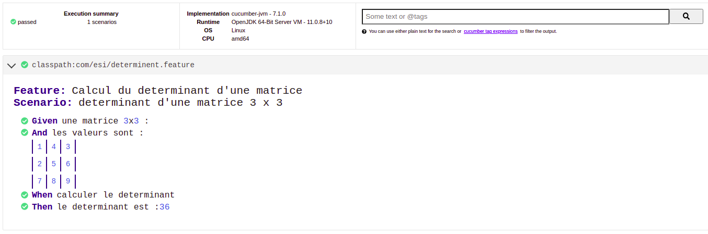
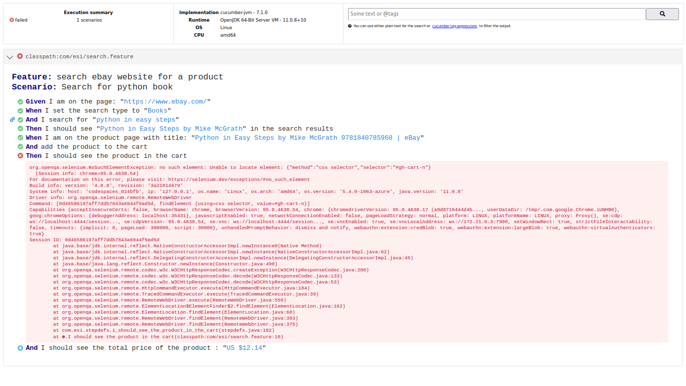

# TPcucumber

### run this repository on cloud vscode IDE by clicking:
  
You need to login with your github account  

Projects are automatiqualy built and tests run at workspace startup
## Exo 1  
reports available in `src/reports/cucumber-html-report.html`  
  

  
  
## Exo 2  
implemented but facing issues (captcha when adding product to cart)  
  
  